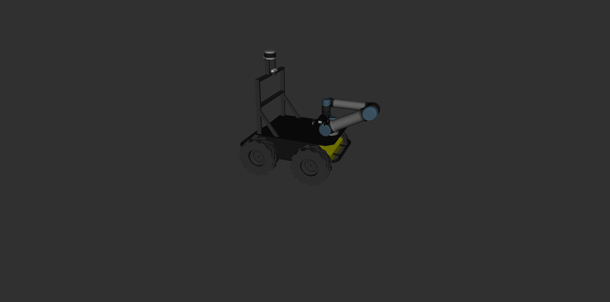
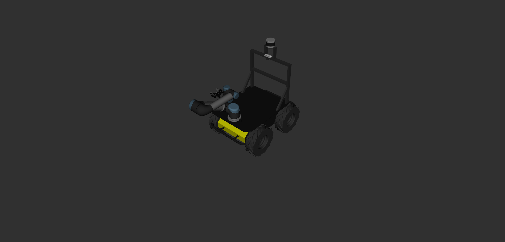

# Husky URDF  
URDF of Clearpath Husky robot with:
  1. UR5 manipulator
  2. Robotiq 85 gripper
  3. Realsense d435 stereocamera
  4. Velodyne VLP16 lidar
  

  



# How to create

Firstly need to create catkin directory:
``` 
mkdir -p ~/test_ws/src
cd ~/test_ws/
catkin_make
```
Then from src download all necessary libs:
``` 
cd ./src
git clone https://github.com/ros-industrial/universal_robot.git
git clone https://github.com/clearpathrobotics/LMS1xx
git clone https://github.com/husky/husky_manipulation
git clone https://github.com/husky/husky
git clone https://github.com/utecrobotics/robotiq
git clone https://github.com/IntelRealSense/realsense-ros
``` 
If you want everything to work fine it is better to delete some folders such as realsense_camera and robotiq_gazebo. Also you can install everything for them to work with ``` rosdep install```. Moreover, we are nor going to use kinematics, so lets delete  ```kinematics_file="${load_yaml('$(arg kinematics_config)')}"``` in husky_ur5_description.urdf.xacro file.


Delete this 3 lines from husky_ur5_description.urdf.xacro file:
```
  <xacro:arg name="kinematics_config" default="$(find ur_description)/config/ur5_default.yaml" />
  <xacro:arg name="transmission_hw_interface" default="hardware_interface/PositionJointInterface"/>
  <xacro:include filename="$(find ur_description)/urdf/common.gazebo.xacro" />
```
Then lets try first model:
```
cd ~/test_ws/
catkin_make 
source ~/test_ws/devel/setup.bash
cd ./src
rosrun husky_ur_moveit_config customize_moveit.sh husky_test
roslaunch husky_test setup_assistant.launch
```

Now we need to compose everything together, so:
* add ```<xacro:include filename="$(find husky_ur_description)/urdf/husky_ur5_description.urdf.xacro" />``` to husky.urdf.xacro
* add ```<xacro:include filename="$(find robotiq_description)/urdf/robotiq_85_gripper.urdf.xacro" />``` to ur5_description.urdf.xacro
* add next part to ur5_description.urdf.xacro 
```
<xacro:robotiq_85_gripper prefix="" parent="${prefix}wrist_3_link" >
   <origin xyz="0 0.0719 0" rpy="0 0 ${pi/2.0}"/>
</xacro:robotiq_85_gripper>
```  


Last part it to enable realsense in husky.urdf.xacro
